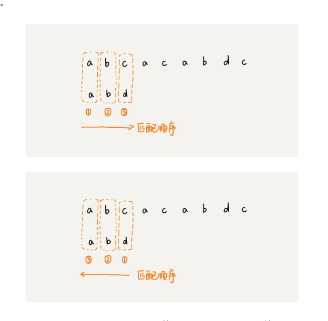

### 字符串匹配算法

#### BF（Brute Force） 算法
```
暴力匹配算法
```

#### BK (Rabin-Karp)算法（对BF 优化）
```
假如主串长度为n，模式串长度m，最多要匹配n-m+1次。
可以先对n-m+1个子串实现哈希，然后再匹配，这样就不用每次都匹配模式串中的字符了。
```

#### BM（Boyer-Moore）算法              -
- 核心思想

```
BF,BK 每次匹配都是移动一个字符，BM每次都移动到下一次可以匹配的字符，这样一下子就可以跳过好几个

BM算法是倒着匹配
匹配思路 坏字符（主串中不能与模式串匹配的字符）
遇到一个不能匹配的字符（坏字符）在模式串中不能匹配的字符的index 设为si
如果这个坏字符在模式串中找不到直接返回-1，如果找的到则将字符（该字符在模式串索引设为xi）移动到这个坏字符上（移动si-xi个位）

```


